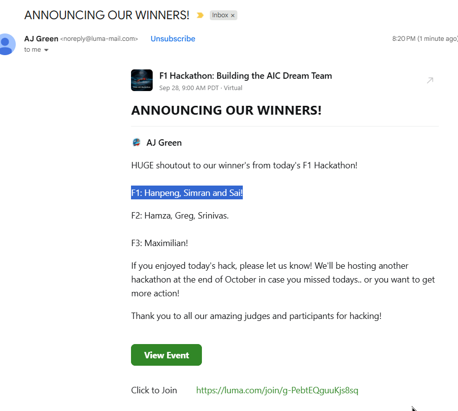
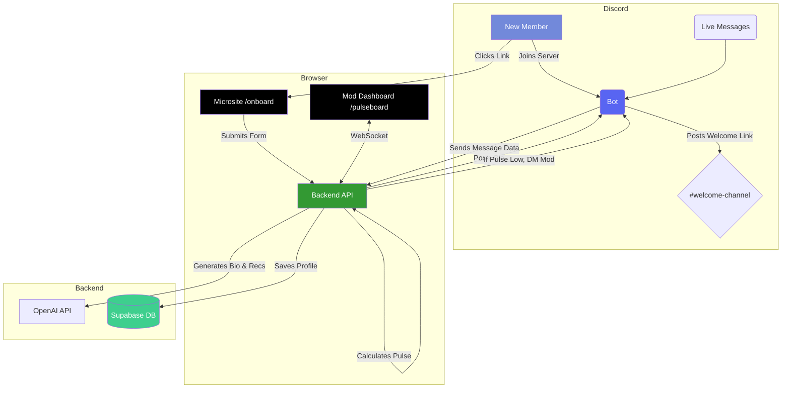

**We Won The Hackathon**


# PulseBoard 🚀

**The AI-powered cockpit for community onboarding and real-time engagement.**

---

### **▶️ Live Demo & MVP Links**

*   **Loom Demo (2 min):** `https://www.loom.com/share/9f0f89f4f86f4a20907bdf0ba2700bda`
*   **Live MVP Link:** `https://pluseboard-tawny.vercel.app/`

---

## 🧐 The Problem

Online communities bleed members for two main reasons:

1.  **Onboarding Overload:** New members join, land in a chaotic `#welcome` channel, and are immediately lost. They don't know which channels to join, who to talk to, or where to find relevant resources. This friction leads to high first-day churn.
2.  **The Sound of Silence:** Conversations lose momentum. Key channels become ghost towns. This "dead air" kills community energy and discourages members, new and old, from participating. Moderators often don't notice until it's too late.

## ✨ The Solution: PulseBoard

PulseBoard is a unified platform that solves both problems by turning raw data into meaningful action. It provides a seamless, personalized onboarding experience and equips moderators with the tools to proactively maintain community vibrancy.

It consists of two core, interconnected features:

1.  **Smart Onboarding Flow:** A personalized microsite that acts as a "Starter Kit," instantly connecting new members to the most relevant people, places, and content within the community.
2.  **Live Engagement Monitor:** A real-time dashboard that tracks the "pulse" of conversations, alerting moderators when energy is dropping and providing AI-generated prompts to revive discussion.

---

## 🎯 Core Features

*   **Personalized Onboarding Microsite:** A one-click welcome page that captures a new member's role and interests.
*   **AI-Generated Member Bios:** Automatically creates and posts a friendly introduction to a `#introductions` channel on the member's behalf.
*   **Curated Recommendations:** Instantly provides tailored suggestions for channels to join, mentors to connect with, and resources to explore.
*   **Real-Time "Community Pulse" Dashboard:** A moderator-facing view showing the live "energy score" of each channel.
*   **AI-Powered Re-engagement Prompts:** When a channel's pulse drops, the system DMs moderators with context-aware conversation starters.
*   **Seamless Discord Integration:** Works directly with your Discord server through a lightweight bot and webhooks.

---

## 🌊 Project Flow

**For a New Member:**
1.  **Join:** Joins the Discord server and sees a "Get Your Starter Kit" link.
2.  **Personalize:** Clicks the link to a microsite, fills out a 3-field form (Name, Role, Interests).
3.  **Connect:** Instantly sees a personalized page with recommended channels, people, and resources.
4.  **Auto-Introduce:** Their AI-generated bio is automatically posted in the `#introductions` channel, sparking their first interactions.

**For a Moderator:**
1.  **Monitor:** Views the `/pulseboard` dashboard to see a real-time health score for all key channels.
2.  **Get Alerted:** Receives a DM from the PulseBoard bot when a channel's engagement score drops below a threshold.
3.  **Take Action:** Uses the AI-suggested, context-aware prompt (e.g., "Ask a poll about X") to instantly re-engage the channel.
4.  **See Impact:** Watches the channel's pulse recover on the dashboard, confirming the intervention worked.

---

## 🛠️ Tech Stack

| Category            | Technology                                                                                                                                                                                                                                                                |
| ------------------- | ------------------------------------------------------------------------------------------------------------------------------------------------------------------------------------------------------------------------------------------------------------------------- |
| **Frontend**        |                                          |
| **Styling**         |                                                                                                                                         |
| **Backend**         |                            |
| **Real-time**       |                                                                                                                                                  |
| **Database**        |                                                                                                                                                      |
| **AI**              |                                                                                                                                                            |
| **Integration**     |                                                                                                                                                   |
| **Deployment**      |                                          |

---

## 🏗️ Architecture



---

## ✅ How We Meet the Hackathon Criteria

| Criteria                    | Our Approach                                                                                                                                        |
| --------------------------- | --------------------------------------------------------------------------------------------------------------------------------------------------- |
| **Code Quality & Org**      | A clean monorepo structure with distinct directories for the `client` and `server`. Code is documented, and API contracts are clear and easy to follow.        |
| **Scalability & Performance** | Built on a modern, scalable stack. The backend is stateless, the database is a managed service (Supabase), and real-time events are handled efficiently via WebSockets.      |
| **Integration & Usability** | Provides a seamless UX loop from Discord to a web app and back again. The onboarding is intuitive for new members, and the dashboard gives mods actionable data, not just noise. |
| **Innovation & Creativity** | We uniquely combine **personalized onboarding** with **proactive, AI-driven engagement monitoring**. We don't just welcome users; we use their data to keep the community healthy long-term. |
| **Community Impact**        | Directly addresses two of the biggest drivers of community churn: poor onboarding and channel inactivity. The impact is measurable through retention stats and the "pulse recovery" metric. |

---

## ⚙️ Getting Started (Local Setup)

1.  **Clone the repository:**
    ```bash
    git clone [https://github.com/SimronJ/f1-hackathon]
    cd [f1-hackathon]
    ```

2.  **Set up environment variables:**
    - Create a `.env.local` file in the `./client` directory.
    - Create a `.env` file in the `./server` directory.
    - Populate them with your keys based on the `.env.example` files in each directory (Discord Bot Token, OpenAI Key, Supabase Keys, etc.).

3.  **Install dependencies for both client and server:**
    ```bash
    # In the root directory
    npm run install:all
    ```

4.  **Run the development servers:**
    ```bash
    # In the root directory
    npm run dev
    ```
    This will start the Next.js frontend and the Node.js backend concurrently.

---

## 🧑‍💻 The Team

*   **Simran** - `[Role, e.g., Backend & Bot Wrangler]`
*   **Sai** - `[Role, e.g., Frontend & UX Magician]`
*   **Yang** - `[Role, e.g., AI Prompt & Integration Lead]`